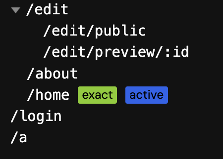

# vite-plugin-vue-convention-route

一个 vue 的约定式路由插件

## Core 核心

`src/convention-route.ts`

## Install 安装

```bash
# 当前插件依赖
npm i vite-plugin-vue-convention-route -D
# 安装babel依赖
npm i @babel/generator@^7.26.3 @babel/traverse@^7.26.4
```

## Usage 使用

```js
import vitePluginAutoRoutes from 'vite-plugin-vue-convention-route'

export default defineConfig({
  plugins: [vue(), vitePluginAutoRoutes({})]
})
```

## Options 选项

|  选项   |         类型         |    默认值     |   描述   |
| :-----: | :------------------: | :-----------: | :------: |
| pageDir |       `string`       | `'src/pages'` | 路由目录 |
| history | `'history' / 'hash'` |   `history`   | 路由前缀 |

## Example 示例


